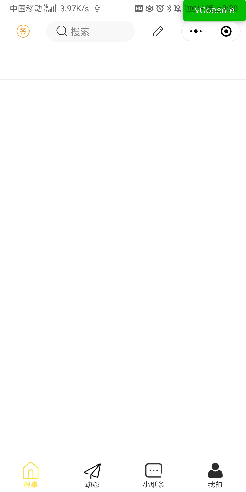
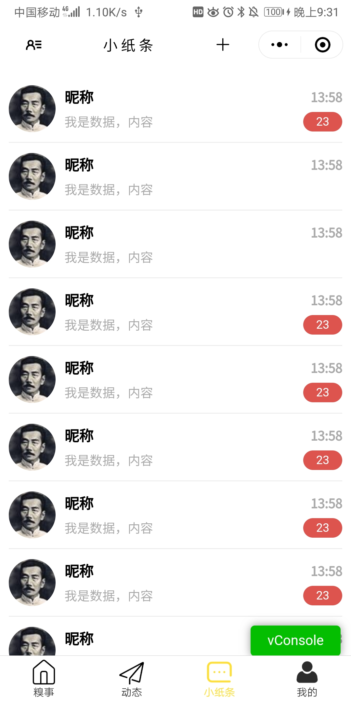
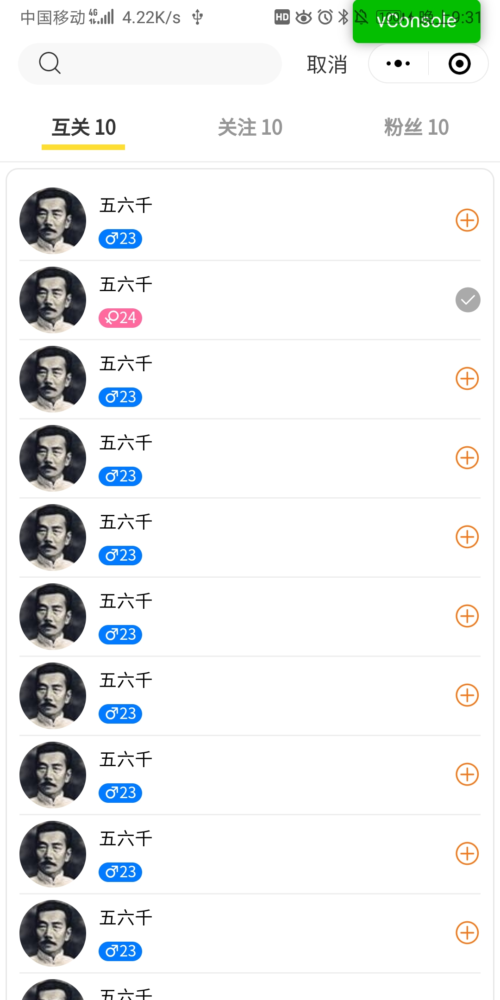
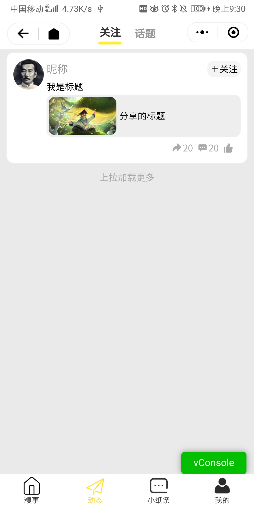
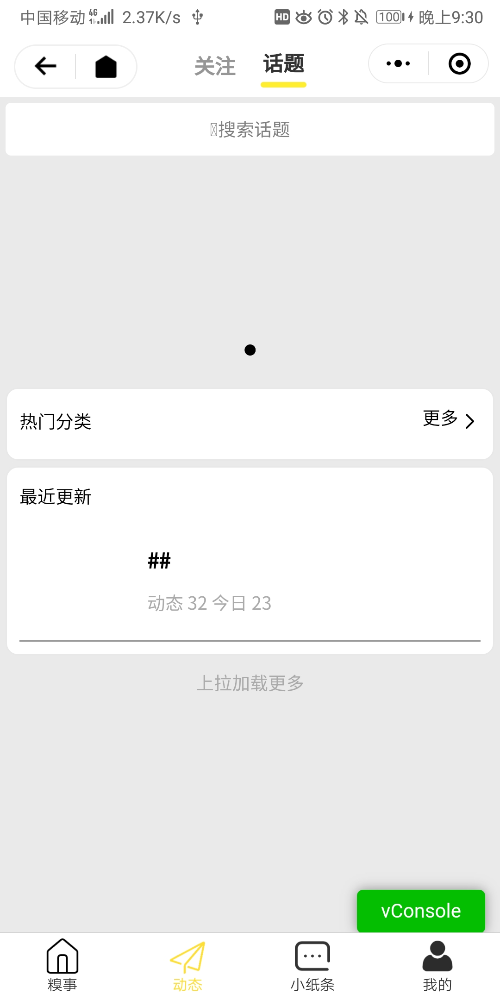
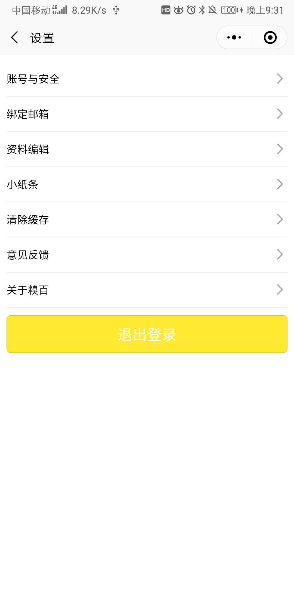
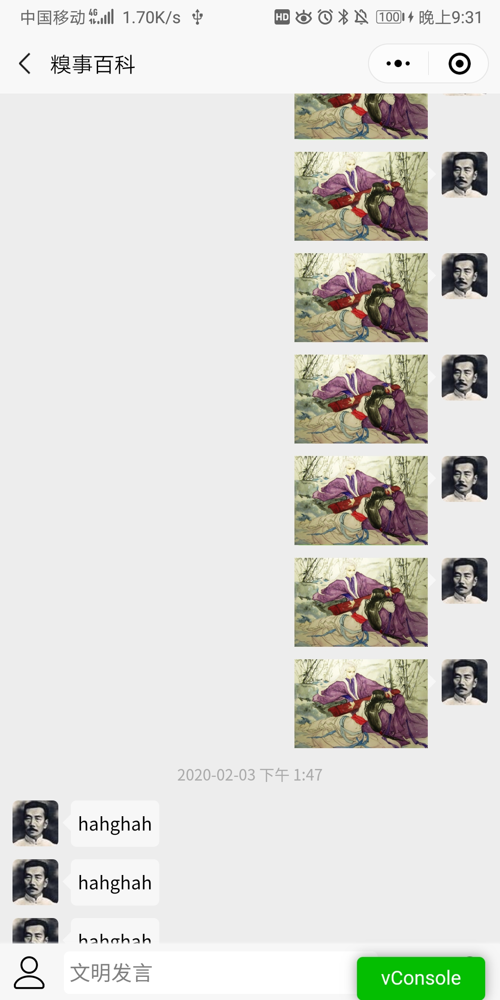
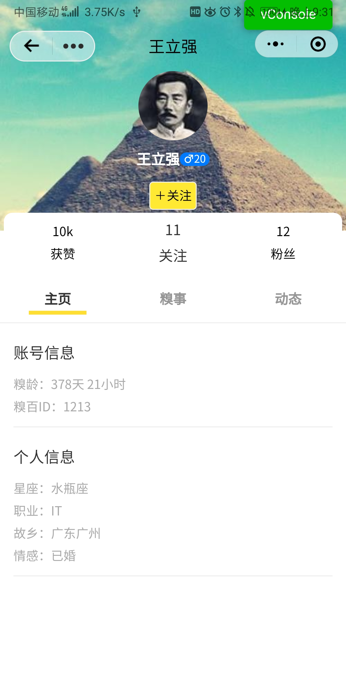

## 仿糗事百科的小程序APP端程序设计

### 主要功能页面展示

    
    
    
    
        
      
    
    
    

<video id="video" controls="" preload="none">
    <source id="mp4" src="./static/baike/video.mp4" type="video/mp4">
</video>

### 实践工程的整个创建于优化过程
1. 在App.vue中导入官方样式库 /commmon/uin.css
2. 使用更改官方模板,实现快速开发
3. 
